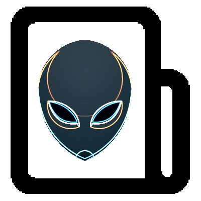

[![Contributors][contributors-shield]][contributors-url]
[![Forks][forks-shield]][forks-url]
[![Stargazers][stars-shield]][stars-url]
[![Issues][issues-shield]][issues-url]
[![GPL3 License][license-shield]][license-url]
[![LinkedIn][linkedin-shield]][linkedin-url]
[![Ask Me Anything][ask-me-anything]][personal-page]

<!-- PROJECT LOGO -->
<br />
<p align="center">
    
  </a>

  <h3 align="center">nikto</h3>

  <p align="center">
    Run nikto in a container
</p>

<!-- TABLE OF CONTENTS -->

## Table of Contents

- [Table of Contents](#table-of-contents)
- [About The Project](#about-the-project)
  - [Built With](#built-with)
- [Getting Started](#getting-started)
  - [Prerequisites](#prerequisites)
  - [Installation](#installation)
    - [Build the image](#build-the-image)
    - [Run the container](#run-the-container)
- [Usage](#usage)
- [Contributing](#contributing)
- [License](#license)
- [Contact](#contact)
- [Acknowledgements](#acknowledgements)

<!-- ABOUT THE PROJECT -->

## About The Project

### Built With

- Docker
- Nikto

---

<!-- GETTING STARTED -->

## Getting Started

### Prerequisites

- Docker ( or any container runtime )

### Installation

#### Build the image

`docker build -t dockerfiles-nikto .`

#### Run the container

- `docker run -it --rm --network=host dockerfiles-nikto -h`

---

<!-- USAGE EXAMPLES -->

## Usage

```bash
$ nikto -h
Option host requires an argument

       -config+            Use this config file
       -Display+           Turn on/off display outputs
       -dbcheck            check database and other key files for syntax errors
       -Format+            save file (-o) format
       -Help               Extended help information
       -host+              target host
       -id+                Host authentication to use, format is id:pass or id:pass:realm
       -list-plugins       List all available plugins
       -output+            Write output to this file
       -nossl              Disables using SSL
       -no404              Disables 404 checks
       -Plugins+           List of plugins to run (default: ALL)
       -port+              Port to use (default 80)
       -root+              Prepend root value to all requests, format is /directory
       -ssl                Force ssl mode on port
       -Tuning+            Scan tuning
       -timeout+           Timeout for requests (default 10 seconds)
       -update             Update databases and plugins from CIRT.net
       -Version            Print plugin and database versions
       -vhost+             Virtual host (for Host header)
                + requires a value

        Note: This is the short help output. Use -H for full help text.
```

---

<!-- CONTRIBUTING -->

## Contributing

Contributions are what make the open source community such an amazing place to be learn, inspire, and create. Any contributions you make are **greatly appreciated**.

1. Fork the Project
2. Create your Feature Branch (`git checkout -b feature/AmazingFeature`)
3. Commit your Changes (`git commit -m 'Add some AmazingFeature'`)
4. Push to the Branch (`git push origin feature/AmazingFeature`)
5. Open a Pull Request

---

<!-- LICENSE -->

## License

Distributed under the GPL-3 License. See `LICENSE` for more information.

<!-- CONTACT -->

## Contact

John Stilia - stilia.johny@gmail.com

---

<!-- ACKNOWLEDGEMENTS -->

## Acknowledgements

- [GitHub Emoji Cheat Sheet](https://www.webpagefx.com/tools/emoji-cheat-sheet)
- [Choose an Open Source License](https://choosealicense.com)
- [GitHub Pages](https://pages.github.com)

<!-- MARKDOWN LINKS & IMAGES -->
<!-- https://www.markdownguide.org/basic-syntax/#reference-style-links -->

[contributors-shield]: https://img.shields.io/github/contributors/stiliajohny/dockerfiles.svg?style=for-the-badge
[contributors-url]: https://github.com/stiliajohny/dockerfiles/graphs/contributors
[forks-shield]: https://img.shields.io/github/forks/stiliajohny/dockerfiles.svg?style=for-the-badge
[forks-url]: https://github.com/stiliajohny/dockerfiles/network/members
[stars-shield]: https://img.shields.io/github/stars/stiliajohny/dockerfiles.svg?style=for-the-badge
[stars-url]: https://github.com/stiliajohny/dockerfiles/stargazers
[issues-shield]: https://img.shields.io/github/issues/stiliajohny/dockerfiles.svg?style=for-the-badge
[issues-url]: https://github.com/stiliajohny/dockerfiles/issues
[license-shield]: https://img.shields.io/github/license/stiliajohny/dockerfiles?style=for-the-badge
[license-url]: https://github.com/stiliajohny/dockerfiles/blob/master/LICENSE.txt
[linkedin-shield]: https://img.shields.io/badge/-LinkedIn-black.svg?style=for-the-badge&logo=linkedin&colorB=555
[linkedin-url]: https://linkedin.com/in/johnstilia/
[product-screenshot]: .assets/screenshot.png
[ask-me-anything]: https://img.shields.io/badge/Ask%20me-anything-1abc9c.svg?style=for-the-badge
[personal-page]: https://github.com/stiliajohny
