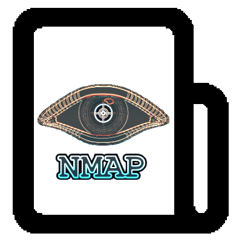

[![Contributors][contributors-shield]][contributors-url]
[![Forks][forks-shield]][forks-url]
[![Stargazers][stars-shield]][stars-url]
[![Issues][issues-shield]][issues-url]
[![GPL3 License][license-shield]][license-url]
[![LinkedIn][linkedin-shield]][linkedin-url]
[![Ask Me Anything][ask-me-anything]][personal-page]

<!-- PROJECT LOGO -->
<br />
<p align="center">
    
  </a>

  <h3 align="center">nmap</h3>

  <p align="center">
    Run nmap in a container
</p>

<!-- TABLE OF CONTENTS -->

## Table of Contents

- [Table of Contents](#table-of-contents)
- [About The Project](#about-the-project)
  - [Built With](#built-with)
- [Getting Started](#getting-started)
  - [Prerequisites](#prerequisites)
  - [Installation](#installation)
    - [Build the image](#build-the-image)
    - [Run the container](#run-the-container)
- [Usage](#usage)
- [Contributing](#contributing)
- [License](#license)
- [Contact](#contact)
- [Acknowledgements](#acknowledgements)

<!-- ABOUT THE PROJECT -->

## About The Project

### Built With

- Docker
- nmap

---

<!-- GETTING STARTED -->

## Getting Started

### Prerequisites

- Docker ( or any container runtime )

### Installation

#### Build the image

`docker build -t dockerfiles-nmap .`

#### Run the container

- `docker run -it --rm --network=host -v ${PWD}:/scans dockerfiles-nmap --help`

---

<!-- USAGE EXAMPLES -->

## Usage

```bash
$ nmap -h
Nmap 7.92 ( https://nmap.org )
Usage: nmap [Scan Type(s)] [Options] {target specification}
TARGET SPECIFICATION:
  Can pass hostnames, IP addresses, networks, etc.
  Ex: scanme.nmap.org, microsoft.com/24, 192.168.0.1; 10.0.0-255.1-254
  -iL <inputfilename>: Input from list of hosts/networks
  -iR <num hosts>: Choose random targets
  --exclude <host1[,host2][,host3],...>: Exclude hosts/networks
  --excludefile <exclude_file>: Exclude list from file
HOST DISCOVERY:
  -sL: List Scan - simply list targets to scan
  -sn: Ping Scan - disable port scan
  -Pn: Treat all hosts as online -- skip host discovery
  -PS/PA/PU/PY[portlist]: TCP SYN/ACK, UDP or SCTP discovery to given ports
  -PE/PP/PM: ICMP echo, timestamp, and netmask request discovery probes
  -PO[protocol list]: IP Protocol Ping
  -n/-R: Never do DNS resolution/Always resolve [default: sometimes]
  --dns-servers <serv1[,serv2],...>: Specify custom DNS servers
  --system-dns: Use OS's DNS resolver
  --traceroute: Trace hop path to each host
SCAN TECHNIQUES:
  -sS/sT/sA/sW/sM: TCP SYN/Connect()/ACK/Window/Maimon scans
  -sU: UDP Scan
  -sN/sF/sX: TCP Null, FIN, and Xmas scans
  --scanflags <flags>: Customize TCP scan flags
  -sI <zombie host[:probeport]>: Idle scan
  -sY/sZ: SCTP INIT/COOKIE-ECHO scans
  -sO: IP protocol scan
  -b <FTP relay host>: FTP bounce scan
PORT SPECIFICATION AND SCAN ORDER:
  -p <port ranges>: Only scan specified ports
    Ex: -p22; -p1-65535; -p U:53,111,137,T:21-25,80,139,8080,S:9
  --exclude-ports <port ranges>: Exclude the specified ports from scanning
  -F: Fast mode - Scan fewer ports than the default scan
  -r: Scan ports consecutively - don't randomize
  --top-ports <number>: Scan <number> most common ports
  --port-ratio <ratio>: Scan ports more common than <ratio>
SERVICE/VERSION DETECTION:
  -sV: Probe open ports to determine service/version info
  --version-intensity <level>: Set from 0 (light) to 9 (try all probes)
  --version-light: Limit to most likely probes (intensity 2)
  --version-all: Try every single probe (intensity 9)
  --version-trace: Show detailed version scan activity (for debugging)
SCRIPT SCAN:
  -sC: equivalent to --script=default
  --script=<Lua scripts>: <Lua scripts> is a comma separated list of
           directories, script-files or script-categories
  --script-args=<n1=v1,[n2=v2,...]>: provide arguments to scripts
  --script-args-file=filename: provide NSE script args in a file
  --script-trace: Show all data sent and received
  --script-updatedb: Update the script database.
  --script-help=<Lua scripts>: Show help about scripts.
           <Lua scripts> is a comma-separated list of script-files or
           script-categories.
OS DETECTION:
  -O: Enable OS detection
  --osscan-limit: Limit OS detection to promising targets
  --osscan-guess: Guess OS more aggressively
TIMING AND PERFORMANCE:
  Options which take <time> are in seconds, or append 'ms' (milliseconds),
  's' (seconds), 'm' (minutes), or 'h' (hours) to the value (e.g. 30m).
  -T<0-5>: Set timing template (higher is faster)
  --min-hostgroup/max-hostgroup <size>: Parallel host scan group sizes
  --min-parallelism/max-parallelism <numprobes>: Probe parallelization
  --min-rtt-timeout/max-rtt-timeout/initial-rtt-timeout <time>: Specifies
      probe round trip time.
  --max-retries <tries>: Caps number of port scan probe retransmissions.
  --host-timeout <time>: Give up on target after this long
  --scan-delay/--max-scan-delay <time>: Adjust delay between probes
  --min-rate <number>: Send packets no slower than <number> per second
  --max-rate <number>: Send packets no faster than <number> per second
FIREWALL/IDS EVASION AND SPOOFING:
  -f; --mtu <val>: fragment packets (optionally w/given MTU)
  -D <decoy1,decoy2[,ME],...>: Cloak a scan with decoys
  -S <IP_Address>: Spoof source address
  -e <iface>: Use specified interface
  -g/--source-port <portnum>: Use given port number
  --proxies <url1,[url2],...>: Relay connections through HTTP/SOCKS4 proxies
  --data <hex string>: Append a custom payload to sent packets
  --data-string <string>: Append a custom ASCII string to sent packets
  --data-length <num>: Append random data to sent packets
  --ip-options <options>: Send packets with specified ip options
  --ttl <val>: Set IP time-to-live field
  --spoof-mac <mac address/prefix/vendor name>: Spoof your MAC address
  --badsum: Send packets with a bogus TCP/UDP/SCTP checksum
OUTPUT:
  -oN/-oX/-oS/-oG <file>: Output scan in normal, XML, s|<rIpt kIddi3,
     and Grepable format, respectively, to the given filename.
  -oA <basename>: Output in the three major formats at once
  -v: Increase verbosity level (use -vv or more for greater effect)
  -d: Increase debugging level (use -dd or more for greater effect)
  --reason: Display the reason a port is in a particular state
  --open: Only show open (or possibly open) ports
  --packet-trace: Show all packets sent and received
  --iflist: Print host interfaces and routes (for debugging)
  --append-output: Append to rather than clobber specified output files
  --resume <filename>: Resume an aborted scan
  --noninteractive: Disable runtime interactions via keyboard
  --stylesheet <path/URL>: XSL stylesheet to transform XML output to HTML
  --webxml: Reference stylesheet from Nmap.Org for more portable XML
  --no-stylesheet: Prevent associating of XSL stylesheet w/XML output
MISC:
  -6: Enable IPv6 scanning
  -A: Enable OS detection, version detection, script scanning, and traceroute
  --datadir <dirname>: Specify custom Nmap data file location
  --send-eth/--send-ip: Send using raw ethernet frames or IP packets
  --privileged: Assume that the user is fully privileged
  --unprivileged: Assume the user lacks raw socket privileges
  -V: Print version number
  -h: Print this help summary page.
EXAMPLES:
  nmap -v -A scanme.nmap.org
  nmap -v -sn 192.168.0.0/16 10.0.0.0/8
  nmap -v -iR 10000 -Pn -p 80
SEE THE MAN PAGE (https://nmap.org/book/man.html) FOR MORE OPTIONS AND EXAMPLES

```

---

<!-- CONTRIBUTING -->

## Contributing

Contributions are what make the open source community such an amazing place to be learn, inspire, and create. Any contributions you make are **greatly appreciated**.

1. Fork the Project
2. Create your Feature Branch (`git checkout -b feature/AmazingFeature`)
3. Commit your Changes (`git commit -m 'Add some AmazingFeature'`)
4. Push to the Branch (`git push origin feature/AmazingFeature`)
5. Open a Pull Request

---

<!-- LICENSE -->

## License

Distributed under the GPL-3 License. See `LICENSE` for more information.

<!-- CONTACT -->

## Contact

John Stilia - stilia.johny@gmail.com

---

<!-- ACKNOWLEDGEMENTS -->

## Acknowledgements

- [GitHub Emoji Cheat Sheet](https://www.webpagefx.com/tools/emoji-cheat-sheet)
- [Choose an Open Source License](https://choosealicense.com)
- [GitHub Pages](https://pages.github.com)

<!-- MARKDOWN LINKS & IMAGES -->
<!-- https://www.markdownguide.org/basic-syntax/#reference-style-links -->

[contributor-shield]: https://img.shields.io/github/contributor/stiliajohny/dockerfiles.svg?style=for-the-badge
[contributor-url]: https://github.com/stiliajohny/dockerfiles/graphs/contributor
[forks-shield]: https://img.shields.io/github/forks/stiliajohny/dockerfiles.svg?style=for-the-badge
[forks-url]: https://github.com/stiliajohny/dockerfiles/network/members
[stars-shield]: https://img.shields.io/github/stars/stiliajohny/dockerfiles.svg?style=for-the-badge
[stars-url]: https://github.com/stiliajohny/dockerfiles/stargazers
[issues-shield]: https://img.shields.io/github/issues/stiliajohny/dockerfiles.svg?style=for-the-badge
[issues-url]: https://github.com/stiliajohny/dockerfiles/issues
[license-shield]: https://img.shields.io/github/license/stiliajohny/dockerfiles?style=for-the-badge
[license-url]: https://github.com/stiliajohny/dockerfiles/blob/master/LICENSE.txt
[linkedin-shield]: https://img.shields.io/badge/-LinkedIn-black.svg?style=for-the-badge&logo=linkedin&colorB=555
[linkedin-url]: https://linkedin.com/in/johnstilia/
[product-screenshot]: .assets/screenshot.png
[ask-me-anything]: https://img.shields.io/badge/Ask%20me-anything-1abc9c.svg?style=for-the-badge
[personal-page]: https://github.com/stiliajohny
