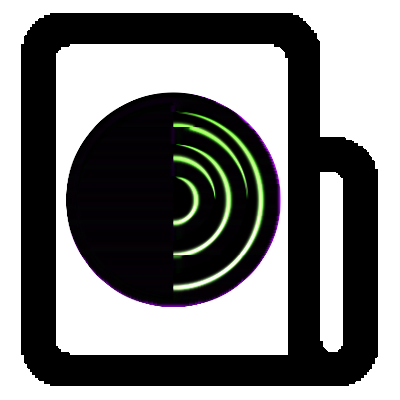

<!-- PROJECT LOGO -->
 

    
  </a>

  <h3 align="center">tor</h3>

  

    Run TOR in a container

<!-- TABLE OF CONTENTS -->

## Table of Contents

- [Table of Contents](#table-of-contents)
- [About The Project](#about-the-project)
  - [Built With](#built-with)
- [Getting Started](#getting-started)
  - [Prerequisites](#prerequisites)
  - [Installation](#installation)
- [Usage](#usage)
- [Contributing](#contributing)
- [License](#license)
- [Contact](#contact)
- [Acknowledgements](#acknowledgements)

<!-- ABOUT THE PROJECT -->

## About The Project

### Built With

- Docker
- Tor

---

<!-- GETTING STARTED -->

## Getting Started

### Prerequisites

- Docker ( or any container runtime )

### Installation

- `docker run -it -p 9050:9050 -d --name dockerfiles-tor dockerfiles-tor`
- `docker-compose up -d`

---

<!-- USAGE EXAMPLES -->

## Usage

Configure your prowser with a socks5 proxy to connect to the tor container

- host: `localhost`
- port (socks5): `9050`

---

<!-- CONTRIBUTING -->

## Contributing

Contributions are what make the open source community such an amazing place to be learn, inspire, and create. Any contributions you make are **greatly appreciated**.

1. Fork the Project
2. Create your Feature Branch (`git checkout -b feature/AmazingFeature`)
3. Commit your Changes (`git commit -m 'Add some AmazingFeature'`)
4. Push to the Branch (`git push origin feature/AmazingFeature`)
5. Open a Pull Request

---

<!-- LICENSE -->

## License

Distributed under the GPL-3 License. See `LICENSE` for more information.

<!-- CONTACT -->

## Contact

John Stilia - stilia.johny@gmail.com

---

<!-- ACKNOWLEDGEMENTS -->

## Acknowledgements

- [GitHub Emoji Cheat Sheet](https://www.webpagefx.com/tools/emoji-cheat-sheet)
- [Choose an Open Source License](https://choosealicense.com)
- [GitHub Pages](https://pages.github.com)
